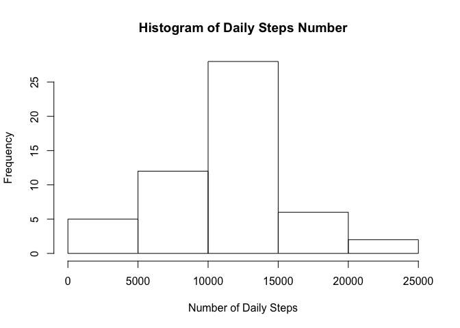
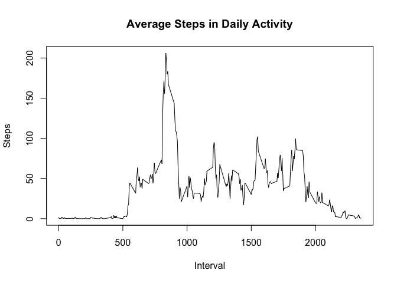
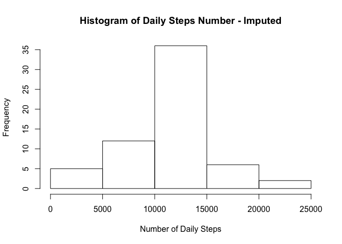
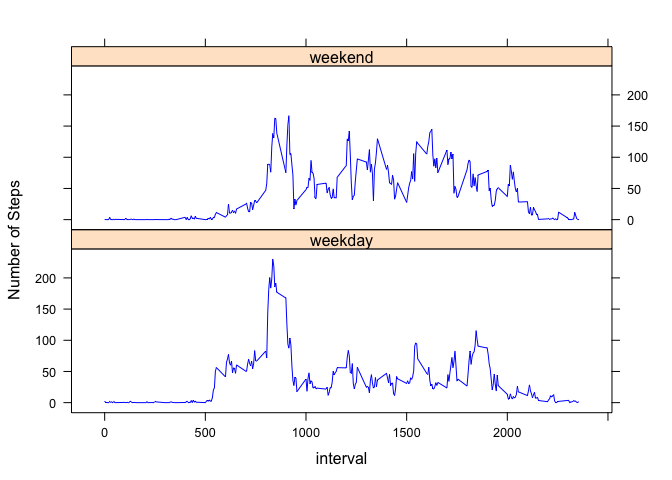

# Reproducible Research: Peer Assessment 1


## Loading and preprocessing the data
Load data from data file

```r
setwd("/Users/amanda/git-repo/RepData_PeerAssessment1")
unzip("activity.zip")
df <- read.csv("activity.csv")
```
Convert date variable to Date format

```r
df$date <- as.Date(df$date,"%Y-%m-%d")
```
Check structure of data

```r
str(df)
```

```
## 'data.frame':	17568 obs. of  3 variables:
##  $ steps   : int  NA NA NA NA NA NA NA NA NA NA ...
##  $ date    : Date, format: "2012-10-01" "2012-10-01" ...
##  $ interval: int  0 5 10 15 20 25 30 35 40 45 ...
```
Read data

```r
dim(df)
```

```
## [1] 17568     3
```

```r
head(df)
```

```
##   steps       date interval
## 1    NA 2012-10-01        0
## 2    NA 2012-10-01        5
## 3    NA 2012-10-01       10
## 4    NA 2012-10-01       15
## 5    NA 2012-10-01       20
## 6    NA 2012-10-01       25
```

```r
# NA value
table(is.na(df$steps))
```

```
## 
## FALSE  TRUE 
## 15264  2304
```

There are 2304 NA values in the data set.

## What is mean total number of steps taken per day?
Clean data by remove NA

```r
df.clean <- df[!is.na(df$steps),]
dim(df.clean)
```

```
## [1] 15264     3
```

```r
head(df.clean)
```

```
##     steps       date interval
## 289     0 2012-10-02        0
## 290     0 2012-10-02        5
## 291     0 2012-10-02       10
## 292     0 2012-10-02       15
## 293     0 2012-10-02       20
## 294     0 2012-10-02       25
```
Make a histogram of the total number of steps taken each day

```r
library(dplyr)
```

```
## 
## Attaching package: 'dplyr'
```

```
## The following objects are masked from 'package:stats':
## 
##     filter, lag
```

```
## The following objects are masked from 'package:base':
## 
##     intersect, setdiff, setequal, union
```

```r
steps.per.day <- df.clean %>%
    tbl_df() %>%
    group_by(date) %>%
    summarise(sum(steps))
names(steps.per.day) <- c("date", "steps")
head(steps.per.day)
```

```
## # A tibble: 6 × 2
##         date steps
##       <date> <int>
## 1 2012-10-02   126
## 2 2012-10-03 11352
## 3 2012-10-04 12116
## 4 2012-10-05 13294
## 5 2012-10-06 15420
## 6 2012-10-07 11015
```

```r
hist(steps.per.day$steps, 
     main = "Histogram of Daily Steps Number", 
     xlab = "Number of Daily Steps")
```

<!-- -->

Calculate and report the mean and median total number of steps taken per day

```r
mean(steps.per.day$steps)
```

```
## [1] 10766.19
```

```r
median(steps.per.day$steps)
```

```
## [1] 10765
```


## What is the average daily activity pattern?
Make a time series plot (i.e. type = "l") of the 5-minute interval (x-axis) and the average number of steps taken, averaged across all days (y-axis)

Get the mean of steps divided by interval accross all days.

```r
mean.steps.at.interval <- df.clean %>%
    tbl_df() %>%
    group_by(interval) %>%
    summarise(mean(steps))
names(mean.steps.at.interval) <- c("interval","mean.steps")
plot(mean.steps.at.interval$interval, mean.steps.at.interval$mean.steps, 
     type = "l",
     main = "Average Steps in Daily Activity",
     xlab = "Interval",
     ylab = "Steps")
```

<!-- -->

Which 5-minute interval, on average across all the days in the dataset, contains the maximum number of steps?
The answer is

```r
n <- which.max(mean.steps.at.interval$mean.steps)
mean.steps.at.interval[n,]
```

```
## # A tibble: 1 × 2
##   interval mean.steps
##      <int>      <dbl>
## 1      835   206.1698
```

## Imputing missing values
Create a separate data frame for missing data

```r
df.na <- df[is.na(df$steps),]
dim(df.na)
```

```
## [1] 2304    3
```

```r
head(df.na)
```

```
##   steps       date interval
## 1    NA 2012-10-01        0
## 2    NA 2012-10-01        5
## 3    NA 2012-10-01       10
## 4    NA 2012-10-01       15
## 5    NA 2012-10-01       20
## 6    NA 2012-10-01       25
```

Use the average steps at 5-minute interval

```r
df.na.impute <- merge(df.na, mean.steps.at.interval)
df.na.impute$steps <- df.na.impute$mean.steps
df.na.impute <- df.na.impute[,c("steps","date","interval")]
```

Check data

```r
dim(df.na.impute)
```

```
## [1] 2304    3
```

```r
head(df.na.impute)
```

```
##      steps       date interval
## 1 1.716981 2012-10-01        0
## 2 1.716981 2012-11-30        0
## 3 1.716981 2012-11-04        0
## 4 1.716981 2012-11-09        0
## 5 1.716981 2012-11-14        0
## 6 1.716981 2012-11-10        0
```

Combine the imputed data frame into the clean data frame

```r
df.complete <- rbind(df.clean, df.na.impute)
dim(df.complete)
```

```
## [1] 17568     3
```

```r
dim(df)
```

```
## [1] 17568     3
```
The new data frame has the same size of the original one.

Make a histogram of the total number of steps taken each day and Calculate using the imputed data

```r
steps.per.day.complete <- df.complete %>%
    tbl_df() %>%
    group_by(date) %>%
    summarise(sum(steps))
names(steps.per.day.complete) <- c("date","steps")
head(steps.per.day.complete)
```

```
## # A tibble: 6 × 2
##         date    steps
##       <date>    <dbl>
## 1 2012-10-01 10766.19
## 2 2012-10-02   126.00
## 3 2012-10-03 11352.00
## 4 2012-10-04 12116.00
## 5 2012-10-05 13294.00
## 6 2012-10-06 15420.00
```

```r
hist(steps.per.day.complete$steps, 
     main = "Histogram of Daily Steps Number - Imputed", 
     xlab = "Number of Daily Steps")
```

<!-- -->
**The plot looks the same as the previous one.**

Calculate and report the mean and median total number of steps taken per day using the imputed data

```r
mean(steps.per.day.complete$steps)
```

```
## [1] 10766.19
```

```r
median(steps.per.day.complete$steps)
```

```
## [1] 10766.19
```
The previous mean and median values are

```r
mean(steps.per.day$steps)
```

```
## [1] 10766.19
```

```r
median(steps.per.day$steps)
```

```
## [1] 10765
```
**From the result, we can see the mean is the same, the median is a little bit smaller. Because we are taking the mean of average steps per day at 5-minute interval. The imputed data has almost no impact on the results. I will use the imputed data frame in the last question.**

## Are there differences in activity patterns between weekdays and weekends?
Create another variable "weekday" to indicate weekday or weekend

```r
df.complete$weekday <- "weekday"
df.complete[weekdays(df.complete$date) %in% c("Saturday","Sunday"),]$weekday <- "weekend"
df.complete$weekday <- as.factor(df.complete$weekday)
```
Take average steps by each interval and weekday

```r
mean.steps.at.interval.per.weekday <- df.complete %>%
    tbl_df() %>%
    group_by(interval,weekday) %>%
    summarise(mean(steps))
names(mean.steps.at.interval.per.weekday) <- c("interval","weekday","mean.steps")
mean.steps.at.interval.per.weekday
```

```
## Source: local data frame [576 x 3]
## Groups: interval [?]
## 
##    interval weekday  mean.steps
##       <int>  <fctr>       <dbl>
## 1         0 weekday 2.251153040
## 2         0 weekend 0.214622642
## 3         5 weekday 0.445283019
## 4         5 weekend 0.042452830
## 5        10 weekday 0.173165618
## 6        10 weekend 0.016509434
## 7        15 weekday 0.197903564
## 8        15 weekend 0.018867925
## 9        20 weekday 0.098951782
## 10       20 weekend 0.009433962
## # ... with 566 more rows
```
Create plot to compare the activity between weekdays and weekend

```r
library(lattice)
xyplot(mean.steps ~ interval| weekday,
       groups=weekday,
       data = mean.steps.at.interval.per.weekday, layout = c(1,2), type="l",
       ylab = "Number of Steps",
       col.line = "blue")
```

<!-- -->

**In weekdays, the person is more active in the morning. In weekends, the activity is more evenly during morning and afternoon.**
